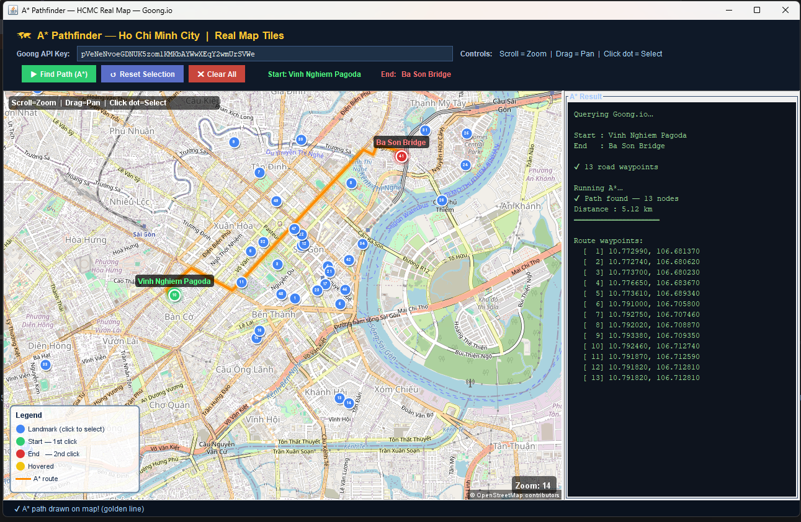
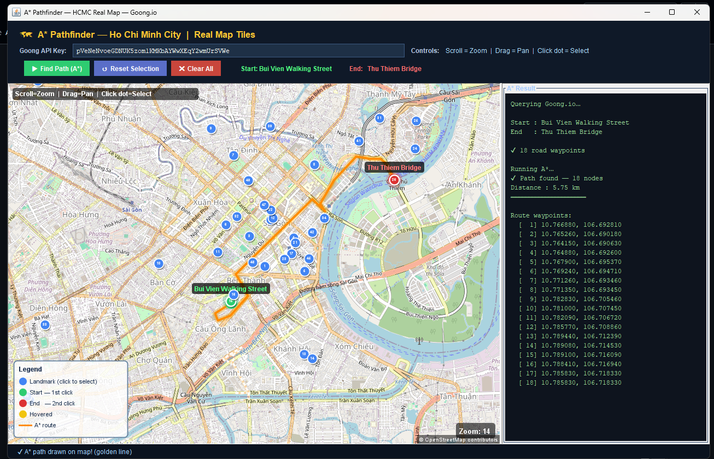

<div align="center">

# 🗺️ A* Pathfinder — Ho Chi Minh City Real Map

Ứng dụng Java Swing mô phỏng thuật toán **A\*** để tìm đường giữa các địa điểm nổi bật tại TP. Hồ Chí Minh, hiển thị trực tiếp trên bản đồ thật bằng **OpenStreetMap tiles** và dữ liệu tuyến đường từ **Goong Directions API**.


</div>

---

## 📌 Giới thiệu

**Astar** là một ứng dụng desktop được viết bằng Java, hỗ trợ người dùng chọn điểm bắt đầu và điểm kết thúc trên bản đồ TP. Hồ Chí Minh. Sau đó chương trình lấy dữ liệu tuyến đường từ Goong API, chuyển các waypoint thành đồ thị và chạy thuật toán **A\*** để tìm đường đi.

Dự án phù hợp cho đồ án môn học hoặc demo thuật toán tìm đường vì có giao diện trực quan, bản đồ thật, điểm mốc cố định và phần kết quả hiển thị rõ từng waypoint của đường đi.

---

## ✨ Tính năng chính

- 🗺️ Hiển thị bản đồ thật bằng tile của OpenStreetMap.
- 📍 Có sẵn danh sách nhiều địa điểm/landmark nổi bật tại TP. Hồ Chí Minh.
- 🖱️ Tương tác trực tiếp trên bản đồ:
  - Scroll để zoom.
  - Kéo chuột để pan bản đồ.
  - Click vào điểm mốc để chọn Start/End.
- 🧭 Gọi Goong Directions API để lấy dữ liệu tuyến đường thực tế.
- ⭐ Chạy thuật toán A\* trên các waypoint nhận được.
- 📏 Tính tổng khoảng cách đường đi bằng công thức Haversine.
- 🟡 Vẽ tuyến đường tìm được lên bản đồ bằng đường màu vàng/cam.
- 💾 Cache map tile xuống thư mục tạm để lần sau tải nhanh hơn.
- 📦 Không cần thư viện ngoài, có JSON parser tối giản tự viết trong project.

---

## 🖼️ Demo giao diện

## Demo





Giao diện chính gồm:

- Khu vực nhập **Goong API Key**.
- Các nút điều khiển: **Find Path**, **Reset Selection**, **Clear All**.
- Bản đồ tương tác ở bên trái.
- Khung kết quả A\* ở bên phải.
- Thanh trạng thái ở phía dưới.

---

## 🧠 Thuật toán sử dụng

Dự án sử dụng thuật toán **A\*** để tìm đường đi ngắn nhất trên đồ thị.

Trong đó:

- `g(n)`: chi phí từ điểm bắt đầu đến node hiện tại.
- `h(n)`: heuristic ước lượng từ node hiện tại đến đích.
- `f(n) = g(n) + h(n)`: tổng chi phí dùng để ưu tiên node trong hàng đợi.

Heuristic trong project được tính bằng khoảng cách Haversine giữa 2 tọa độ địa lý.

### Luồng xử lý A\* trong project

1. Người dùng chọn Start và End trên bản đồ.
2. Ứng dụng gọi Goong Directions API để lấy danh sách waypoint.
3. Chuyển danh sách waypoint thành các `Node`.
4. Nối các node liên tiếp bằng `Edge` có trọng số là khoảng cách Haversine.
5. Chạy A\* từ node đầu tiên đến node cuối cùng.
6. Truy vết `parent` để dựng lại đường đi.
7. Vẽ kết quả lên bản đồ.

---

## 🏗️ Cấu trúc thư mục

```text
Astar/
├── .idea/                          # Cấu hình IntelliJ IDEA
├── Demo/                           # Demo 
│   ├── demo1.png
│   └── demo2.png
├── src/
│   └── astar/
│       ├── algorithm/
│       │   └── AStarEngine.java    # Xây graph và chạy thuật toán A*
│       ├── api/
│       │   └── GoongApiClient.java # Gọi Goong Directions API và parse waypoint
│       ├── app/
│       │   └── Main.java           # Entry point của chương trình
│       ├── data/
│       │   └── LandmarkData.java   # Danh sách địa điểm cố định tại TP.HCM
│       ├── model/
│       │   ├── Edge.java           # Cạnh của đồ thị
│       │   ├── LatLng.java         # Model tọa độ latitude/longitude
│       │   └── Node.java           # Node dùng trong A*
│       ├── ui/
│       │   ├── MainFrame.java      # Giao diện chính Java Swing
│       │   └── map/
│       │       └── TileMapPanel.java # Panel vẽ bản đồ, marker và route
│       └── util/
│           ├── GeoMath.java        # Haversine + chuyển đổi Mercator
│           └── JSON.java           # JSON parser tối giản
├── .gitignore
└── A Star Mid Term.iml
```

---

## 🛠️ Công nghệ sử dụng

| Thành phần | Công nghệ |
|---|---|
| Ngôn ngữ | Java |
| UI Desktop | Java Swing |
| Thuật toán | A\* Search |
| Bản đồ | OpenStreetMap Tile Server |
| Route API | Goong Directions API |
| Tính khoảng cách | Haversine Formula |
| Parse JSON | Custom minimal JSON parser |
| IDE phù hợp | IntelliJ IDEA |

---

## ⚙️ Yêu cầu môi trường

Trước khi chạy project, cần cài:

- **JDK 8 trở lên**.
- **IntelliJ IDEA** hoặc IDE Java tương đương.
- Kết nối Internet để tải map tile và gọi Goong API.
- Một **Goong API Key** hợp lệ.

---

## 🚀 Cách chạy project

### Cách 1: Chạy bằng IntelliJ IDEA

1. Clone repository:

```bash
git clone https://github.com/PiupiuTenshi/Astar.git
cd Astar
```

2. Mở project bằng IntelliJ IDEA.
3. Chọn thư mục `src` → **Mark Directory as** → **Sources Root** nếu IDE chưa nhận.
4. Mở file:

```text
src/astar/app/Main.java
```

5. Run file `Main.java`.
6. Nhập Goong API Key vào ô trên giao diện.
7. Click landmark đầu tiên để chọn **Start**.
8. Click landmark thứ hai để chọn **End**.
9. Nhấn **Find Path (A*)** để tìm và vẽ đường đi.

---

### Cách 2: Chạy bằng terminal

#### Linux/macOS/Git Bash

```bash
git clone https://github.com/PiupiuTenshi/Astar.git
cd Astar
mkdir -p out
javac -encoding UTF-8 -d out $(find src -name "*.java")
java -cp out astar.app.Main
```

#### Windows PowerShell

```powershell
git clone https://github.com/PiupiuTenshi/Astar.git
cd Astar
New-Item -ItemType Directory -Force out
javac -encoding UTF-8 -d out -sourcepath src src\astar\app\Main.java
java -cp out astar.app.Main
```

---

## 🔑 Cấu hình Goong API Key

Ứng dụng cần Goong API Key để gọi Directions API.

Khi chạy chương trình:

1. Lấy API key từ Goong.
2. Dán key vào ô **Goong API Key** trên giao diện.
3. Chọn điểm bắt đầu/kết thúc.
4. Nhấn **Find Path (A*)**.

### Khuyến nghị bảo mật

Không nên hard-code API key trực tiếp trong source code. Nên dùng một trong các cách sau:

- Nhập key thủ công qua giao diện.
- Đọc key từ biến môi trường, ví dụ `GOONG_API_KEY`.
- Đọc key từ file cấu hình local và thêm file đó vào `.gitignore`.

Ví dụ đọc từ biến môi trường:

```java
String apiKey = System.getenv("GOONG_API_KEY");
```

⚠️Lưu ý: Trong repo này, Api Key miễn phí, public để dễ test.

---

## 📍 Danh sách điểm mốc

Project có sẵn nhiều địa điểm tại TP. Hồ Chí Minh, ví dụ:

- Ben Thanh Market
- Notre-Dame Cathedral
- Reunification Palace
- Saigon Opera House
- Bitexco Financial Tower
- War Remnants Museum
- Landmark 81
- Tan Son Nhat Airport
- Bui Vien Walking Street
- Nguyen Hue Walking Street
- Saigon Central Post Office
- Vinhomes Central Park
- Crescent Mall
- Mien Dong Bus Station
- Mien Tay Bus Station

Danh sách đầy đủ nằm trong:

```text
src/astar/data/LandmarkData.java
```

---

## 🧩 Mô tả các class quan trọng

### `Main.java`

Entry point của chương trình. File này thiết lập một số thuộc tính render cho Java2D, set look and feel theo hệ điều hành và mở `MainFrame`.

### `MainFrame.java`

Quản lý giao diện chính:

- Header nhập API key.
- Nút tìm đường và reset.
- Khu vực bản đồ.
- Khu vực hiển thị kết quả thuật toán.
- Xử lý sự kiện chọn Start/End.
- Gọi API, chạy A\* bằng `SwingWorker` để không làm đơ giao diện.

### `TileMapPanel.java`

Panel bản đồ:

- Tải tile từ OpenStreetMap.
- Cache tile trong RAM và ổ đĩa tạm.
- Hỗ trợ zoom, pan, hover marker.
- Vẽ landmark, route, Start/End marker và legend.

### `AStarEngine.java`

Chứa logic chính của thuật toán:

- `buildGraph(...)`: tạo graph từ danh sách waypoint.
- `findPath(...)`: chạy A\* bằng `PriorityQueue`.
- `rebuild(...)`: truy vết đường đi từ node đích về node đầu.

### `GoongApiClient.java`

Chịu trách nhiệm:

- Gửi request đến Goong Directions API.
- Nhận JSON response.
- Parse các waypoint từ route/legs/steps.

### `GeoMath.java`

Chứa các hàm toán học:

- Tính khoảng cách Haversine giữa 2 tọa độ.
- Chuyển đổi Mercator phục vụ việc render bản đồ.

---

## 🧪 Cách sử dụng nhanh

1. Mở app.
2. Chờ map tile tải xong.
3. Click một điểm màu xanh dương để chọn Start.
4. Click điểm khác để chọn End.
5. Nhấn **Find Path (A*)**.
6. Xem kết quả ở khung bên phải:
   - Số waypoint.
   - Số node trên path.
   - Tổng khoảng cách.
   - Danh sách tọa độ đường đi.
7. Xem tuyến đường màu vàng/cam được vẽ trên bản đồ.

---

## ⚠️ Một số lỗi thường gặp

### 1. Không tải được bản đồ

Nguyên nhân có thể là:

- Máy không có Internet.
- OpenStreetMap tile server phản hồi chậm.
- Mạng chặn kết nối đến tile server.

Cách xử lý:

- Kiểm tra Internet.
- Thử chạy lại app.
- Zoom/pan nhẹ để tile được tải lại.

---

### 2. Goong API báo lỗi

Nguyên nhân có thể là:

- API key sai hoặc hết hạn.
- Key chưa bật quyền Directions API.
- Vượt giới hạn request.

Cách xử lý:

- Kiểm tra lại Goong API Key.
- Tạo key mới nếu cần.
- Xem log lỗi trong khung kết quả.

---

### 3. Chạy terminal bị lỗi font tiếng Việt

Hãy compile với encoding UTF-8:

```bash
javac -encoding UTF-8 -d out $(find src -name "*.java")
```

---


## 📚 Kiến thức liên quan

Dự án giúp luyện tập các kiến thức:

- Thuật toán tìm kiếm đường đi A\*.
- Priority Queue trong Java.
- Đồ thị có trọng số.
- Heuristic function.
- Công thức Haversine.
- Java Swing GUI.
- Multithreading với `SwingWorker`.
- Gọi REST API bằng `HttpURLConnection`.
- Parse JSON cơ bản.
- Render bản đồ bằng tile.

---

## 👤 Tác giả

- GitHub: [@PiupiuTenshi](https://github.com/PiupiuTenshi)
- Repository: [PiupiuTenshi/Astar](https://github.com/PiupiuTenshi/Astar)
- Collab: [Nguyễn Văn Quyến] && [Nguyễn Nhựt Quỳnh]

---


